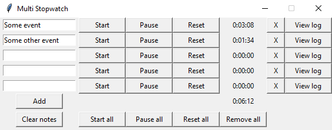
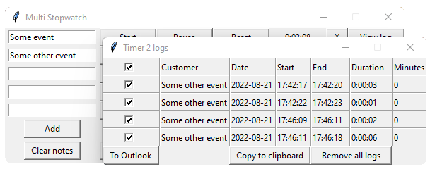

# MultiStopwatch
Stopwatch application for managing time spent on each customer or event.

## Main features
- Label and manage multiple stopwatches at a time
- Export stopwatch data to clipboard or as a calendar event (e.g. Microsoft Outlook)

## Installation
Note: This application is compatible only with Windows, because it utilizes the win32 api for handling the clipboard.

To install the required packages:
```
pip install -r requirements.txt
```
To start the application:
```
python msw.py
```

## Screenshots


